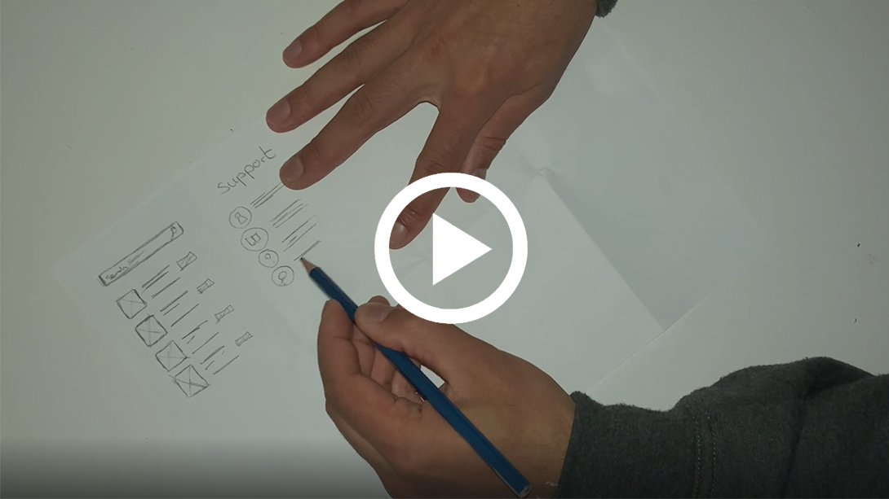
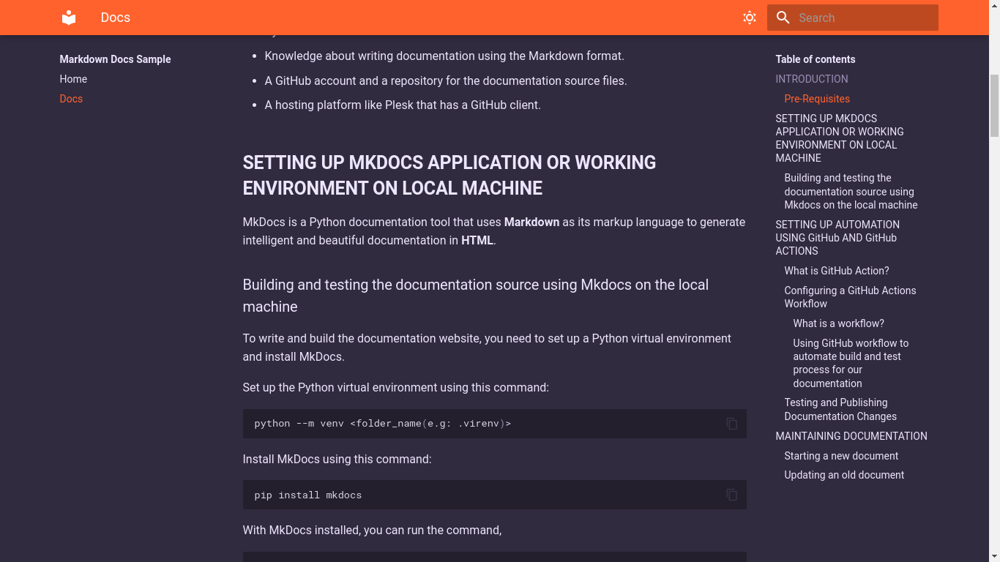
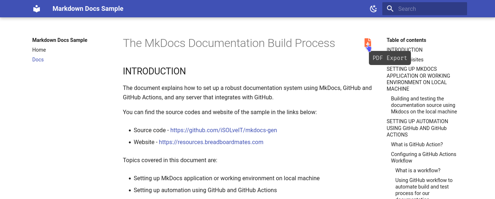

# Local Healthcare Application 


**Challenge:** Create a application that helps individuals and communities to access (local) healthcare.

**Solution:** Medipath is a responsive and accessible app that offers medical solutions, healthcare and products to individuals.
<br><br>


**Topics we'll be covering and what we've learned:**

-   Creating personas and user stories
-   Sketching wireframes
-   Affinity diagrams, themes and insights
-   Prototyping
-   Competitive audits
-   Research studies

<br>


## Emphatize

The first stages of the Design Thinking process involves developing a sense of empathy towards the people you are designing for, to gain insights into what they need, what they want, how they behave, feel, and think, and why they demonstrate such behaviors, feelings, and thoughts when interacting with products in a real-world setting.


### Personas ###

We started our project by empathizing with users and creating random personas that meets solutions for all users.

<details> 
  <summary>What are personas?</summary>
<br>
"Personas are fictional characters, which you create based upon your research in order to represent the different user types that might use your service, product, site, or brand in a similar way. Creating personas helps the designer to **understand users’ needs, experiences, behaviors and goals"
<br>
</details>

<br>


!!! Summary

    Shima is a model that experienced a drastic trauma when she was younger. She has a quite busy lifestyle and is always on the move. Unfortunately she hasn't             recovered yet from her past and requires therapy twice a week. She doesn't have much time and wants to discover a better alternative to therapy sessions. 
 

<br>


!!! Summary

    Leo recently moved from Italy to the Netherlands and doesn't speak the local language. He wants to work but hasn't any legal documents like health insurance.
    He needs more information and whereabouts to get start working.
 


<br><br>
### User stories ###

To better understand users we must create user stories based on the data of **personas.** This is so we can better recognize the user and their needs. 

<details> 
 <summary>What are User stories?</summary>
<br>
 A user story is a small, self-contained unit of development work designed to accomplish a specific goal within a product. A user story is usually written from the user's perspective and follows the format: “As [a user persona], I want [to perform this action] so that [I can accomplish this goal].”
<br>
</details>


<br><br>
### Journey Mapping ###


To get more information about the user we need to know their emotions and interactions between the product. We do this by creating a journey map. By capturing the user actions we can understand more clearly about their paint points.


<details> 
 <summary>Short summary of journey mapping</summary>
<br>
A journey map is a visualization of the process that a person goes through in order to accomplish a goal.
In its most basic form, journey mapping starts by compiling a series of user actions into a timeline. Next, the timeline is fleshed out with user thoughts and emotions in order to create a narrative. This narrative is condensed and polished, ultimately leading to a visualization.
<br>
</details>


> **Note**
> We were unable to create a journey map for the persona "Leo" because he didn't have enough ability to execute a action. Since he was unable to communicate with locals and couldn't find any information related to registering his health insurance papers. We came up with the idea to create a **Knowledgebase** or **Informational blog** translated in 5 different languages so everyone could understand. Furthermore, in collaboration with government instances users could be forwarded to a appointment link. *More to follow in affinity diagrams.*
 
<br><br>


## Define and Ideate


Advancing further in the design thinking process we come to define and ideate phases, Ideation is a creative process where designers generate ideas in sessions (e.g., brainstorming, worst possible idea). Participants gather with open minds to produce as many ideas as they can to address a problem statement in a facilitated, judgment-free environment.

<br>


### Competitive audits ###
**Competitive audits** are one of the many valuable steps you can take during the ideation process. A competitive audit is an overview of your competitors’ strengths and weaknesses. Analyzing the brands and products of competitors, or the companies who offer similar products as you do, can give you a well-rounded foundation of knowledge about the market your product will enter. 


### Crazy 8's
Next up is pen to paper. Crazy 8’s is a core Design Sprint method. It is a fast sketching exercise that challenges people to sketch eight distinct ideas in eight minutes. The goal is to push beyond your first idea, frequently the least innovative, and to generate a wide variety of solutions to your challenge.


[](https://studies.divstack.io/crazy8.mp4)

<br>

### Sketching paper wireframes ###
Wireframes help us establish the basic layout of a screen. A layout is the structure that supports how visual components on a page are arranged, like images, text, and icons. Because paper wireframes are inexpensive and easy to create, you can draw multiple wireframes for the same screen of an app or website to explore a bunch of design possibilities. 


### Digital wireframes ###

We are contineuing our case study to screen time. We start by converting our ideas to digital wireframes through the **figma application**. 
If you do not know what figma is, learn more so here: <https://www.freecodecamp.org/news/figma-crash-course/>


MkDocs is a Python documentation tool that uses **Markdown** as its
markup language to generate intelligent and beautiful documentation in
**HTML**.

### Building and testing the documentation source using Mkdocs on the local machine

To write and build the documentation website, you need to set up a
Python virtual environment and install MkDocs.

Set up the Python virtual environment using this command:

```bash
python --m venv <folder_name(e.g: .virenv)>
```

Install MkDocs using this command:

```bash
pip install mkdocs
```

With MkDocs installed, you can run the command,

```bash title="Create a new MkDocs project"
mkdocs new <project_directory>
```

to create a new MkDocs project that contains a source directory
(**docs**) and a default **mkdocs.yml** file with the most useful
configuration values.

The **mkdocs.yml** contains the MkDocs configurations, where you can
configure all aspects of how MkDocs reads your sources and builds your
documentation.


<p style="text-align:center"><i>Fig. 1: Source directory for a MkDocs documentation</i></p>


MkDocs reads its contents from files with the extension `.MD` which you
have referenced in the **mkdocs.yml** file. These `.MD` files contain
the structure of the documentation and the text to be displayed on the
documentation website.

After you have set up the source directory for the documentation, you
can use the command below to run the built-in development server
provided by MkDocs.

```bash title="Run the built-in development server"
mkdocs serve
```

You can use the development server to test your documentation while
building it. It is important to note that this command does not provide
the documentation build files.

To generate the documentation build files, you can run this command:

```bash title="Build the MkDocs documentation"
mkdocs build
```

The command above builds the MkDocs documentation into a folder called
**site**.

After writing and testing the documentation source on the local machine,
you can transfer the source files (without the **site** folder) to your
GitHub remote repository.

## **SETTING UP AUTOMATION USING GitHub AND GitHub ACTIONS**

On the GitHub remote repository, we must set up GitHub Action workflows
to handle automatic testing and building of the documentation whenever
we trigger a push or pull request event.

### What is GitHub Action?

GitHub Action is a [(CI/CD)](https://en.wikipedia.org/wiki/CI/CD) platform that
allows you to automate your build, test, and deployment pipeline using
workflows. When using GitHub Action, GitHub will provide you with Linux,
Windows, and macOS virtual machines to run your workflows.

You can configure GitHub Action workflows to trigger when an event, such
as a push, occurs in your repository.

### Configuring a GitHub Actions Workflow

#### **What is a workflow?**

A workflow is a configurable and automated process that runs one or more
jobs. Each job runs inside its virtual machine runner, or a container,
and has one or more steps that either run a script you defined or run an
action from the GitHub Marketplace.

Workflows are defined by a YAML file checked in your repository and are
triggered either manually or by an event in the repository. Below is an
example of a GitHub Action workflow.


<p style="text-align:center"><i>Fig. 2: A YAML file for a GitHub Action workflow</i></p>


#### **Using GitHub workflow to automate build and test process for our documentation**

For us to build and test the documentation, we will configure two (2)
GitHub Actions workflows and store them under the
**.github/workflows** directory. The two (2) GitHub Actions
workflows are **mkdocs_test.yml** and **main.yml**.

The **mkdocs_test.yml** workflow runs a CI test to check if the links in
the documentation works. We trigger this workflow on each pull request
events sent to the **main** branch of the official repository.

The **main.yml** workflow, on the other hand, check if the links in the
documentation works, compiles the MkDocs sources in the official
repository's **main** branch, and updates the **docs-build** branch with
the build files. We trigger this workflow on each push events on the
**main** branch of the official repository.

### Testing and Publishing Documentation Changes

On the official repository, if a contributor sends a pull request to the
repository's **main** branch, we test the changes by running the "*Pull
Request MkDocs Check*" (i.e., mkdocs_test.yml) workflow.

If the test is successful, then the documentation project maintainer
will merge the pull request changes after reviewing the pull request.
This is to ensure that we review the changes in the pull request before
merging into the official repository.

When the documentation project maintainer merges the pull request
changes to the repository's **main** branch, GitHub triggers the
"*Compile MkDocs source and update **docs-build** branch*" (i.e.,
main.yml) workflow automatically to build the documentation.

If the build is successful, it sends the documentation build files to
the **docs-build** branch. The **docs-build** branch is where the
hosting platform copies the documentation build files to update the
documentation website.

## **MAINTAINING DOCUMENTATION**

### Creating the structure of a document

Markdown lets you add structural elements to your document, such as **headings** (`h1`, `h2`, `h3` etc.). 
The hashes move lower-level headings further to the right, so they appear indented. 
There are a few ways to add headings in Markdown. 
The recommended one is to prefix a heading with hashes **#**, one for each level of heading:

```markdown
# Heading 1
## Heading 2
### Heading 3

And this is a paragraph.

```
Sections of a document can be separated using **horizontal rules** (`<hr />`), or lines. 
You create these in Markdown using three (or more) hyphens `-`, asterisks `*`, underscores `_`or equals `=` signs. 
Place them alone on a line, with blank lines on either side:

```markdown

Brief introduction.
===
# Chapter 1
Lots of text.
---
# Chapter 2
Some more text
---

```

**Lists** are another important structural element. 
Unordered lists (`<ul>`) are created by beginning the line with an asterisk `*`, plus `+` symbol, or hyphen `-`, 
followed by a space or tab, then the text.

Ordered lists (`<ol>`) are numbers followed by periods. The numbers don't necessarily have to be in order.
Below is an example of an unordered and ordered lists

```markdown

### Unordered List
* this is an
* unordered list

+ this is another
+ unordered list

### Ordered List
1. this is an
2. ordered
3. list
   
1. and so 
1. is this too

```

!!! note

    If you want to start a line with a number and a period without starting a list, 
    you need to escape the period with a backslash \: 

    ```markdown
    2020\. A year we'll never forget.
    ```

Finally, paragraphs of normal text are separated by one or more blank lines:

```markdown

This will be formatted as an HTML paragraph.
```
### Starting a new document

MkDocs uses regular Markdown (`.md`) files as the source for its
documentation. We place these Markdown files in the documentation
directory called **docs** which exist at the top level of your project,
alongside the **mkdocs.yml** configuration file.

All Markdown files included in your documentation directory will be
rendered in the built site, regardless of any settings.

The simplest project you can create will look something like this:

```
mkdocs.yml
docs/
	index.md
```

You can also create multipage documentation, by creating several
Markdown files:

```
mkdocs.yml
docs/
	index.md
	about.md
	changelog.md
```

The file layout you use determines the URLs that are used for the
generated pages. Given the above layout, pages would be generated for
the following URLs:

```
/
/about/
/changelog/
```

You can also include your Markdown files in nested directories if that
better suits your documentation layout.

```
docs/
	index.md
	user-guide/getting-started.md
	user-guide/configuration-options.md
	changelog.md
```

Source files inside nested directories will cause pages to be generated
with nested URLs, like so:

```
/
/user-guide/getting-started/
/user-guide/configuration-options/
/changelog/
```

After creating the Markdown files in your documentation directory, you
must configure pages and navigation in the **mkdocs.yml** file.

The `nav` configuration setting in your **mkdocs.yml** file defines
which pages are included in the global site navigation menu, as well as
the structure of that menu. If not provided, the navigation will be
automatically created by discovering all the Markdown files in the
documentation directory.

A minimal navigation configuration could look like this:

```yaml
nav:
	- 'index.md'
	- 'about.md'
```

or

With user-defined titles

```yaml
nav:
	- Home: 'index.md'
	- About: 'about.md'
```

After configuring pages and navigation, you can test the documentation
by executing the command below to start the built-in development server:

```bash title="Run built-in development server"
mkdocs serve
```
!!! note

    The development server will not start successfully if there is
    an error in the source files.

### Updating an old document

Updating an old document is easy. You just have to find the old document
(`.md`) file and make the necessary changes to it. You must ensure the
configuration file (**mkdocs.yml**) is intact.

After making the changes, execute the command below to start the
built-in development server:


```bash title="Run built-in development server"
mkdocs serve
```

!!! note

    The development server will not start successfully if there is
    an error in the source files.

### Serving images in a document
In MkDocs, images are served from the **
** folder in the **docs** directory. 
You can then link an image in a source file by using the relative path to that image. 

!!! note

    It is not compulsory to store the images under the **img** folder. 
    You can decide to store your images in any folder, but the folder should be in the **docs** directory.

The code below shows how to add an image using the Markdown syntax:

```markdown

<>


```

<p style="text-align:center"><i>Fig. 3: Output of the code above</i></p>

!!! tip

    To properly maintain images for large documentation sources, it will be appropriate to divide your 
    images into parts and store them in separate sub-folders under the **img** folder. 
    For example, all images for the homepage should be stored in the folder called *homepage* and images for 
    the about section should be stored in the folder called *about*.

### How to generate a PDF for a specific page in the documentation
To generate a PDF for a specific page, you need to add the MkDocs PDF Export Plugin to your MkDocs project.

The MkDocs PDF Export Plugin is a plugin to export content pages as PDF files. 
Before installing the plugin, you need to have some packages, which the 
[plugin’s documentation](https://github.com/zhaoterryy/mkdocs-pdf-export-plugin) explain.

Install the package with pip:
```bash
pip install mkdocs-pdf-export-plugin
```

Enable the plugin in your `mkdocs.yml`:
```yaml
plugins:
    - search
    - pdf-export

```

When you build the documentation, you will see a download button, as described in Fig. 4 below, 
for every page in your MkDocs project.


<p style="text-align:center"><i>Fig. 4: PDF download button for index page</i></p>
